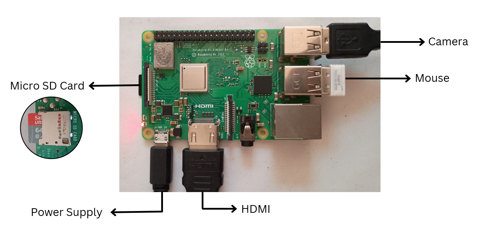

# action-recognition-system
## Overview

This project is a real-time action recognition system designed to assist individuals with speech impairments by converting predefined hand gestures into spoken words. The system uses a Raspberry Pi, a USB camera, computer vision, and text-to-speech technology to recognize user actions and generate corresponding voice output.

The project demonstrates the application of embedded systems, artificial intelligence, and computer vision to create an affordable assistive communication device.


## Technology Used
### Software
- Raspberry Pi Imager
- PuTTy
- VNC Viewer
- VS Code
- Raspbian OS (Legacy, 64-bit)
### Hardware
- Raspberry Pi 3B+
- USB WebCam
- HDMI Monitor
- Keyboard & Mouse
- Bluetooth Speaker
- SD Card (64GB)
### Python Libraries
- opencv
- mediapipe
- numpy
- pyttsx3
- tkinter
- pillow

## Project Structure
```text
Action-Recognition-System/
│
├── main.py
├── camera_capture.py
├── pose_detector.py
├── action_classifier.py
├── tts_engine.py
├── gui_window.py
└── requirements.txt
```




